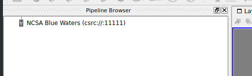

ParaView
========

ParaView is a parallel visualization package based on the VTK C++
library. ParaView supports client/server interactive mode as well as
Python scripted batch mode. The server side of the application is a
distributed memory MPI-based parallel application. In interactive mode,
the server component runs on the Blue Waters compute nodes and
communicates with a client program running on a user's local machine. In
batch execution mode, the pvbatch server runs an analysis script,
written in Python, on the Blue Waters compute nodes. No interaction is
possible in batch mode. Batch executed instances save images or geometry
on the Blue Waters file system for later viewing.

Support for ParaView components is limited to server side programs on
the Blue Waters system such as pvserver and pvbatch. The paraview client
binary is not installed on Blue Waters.

Using Paraview on Blue Waters
-----------------------------

Two modes of operation are supported on the Blue Waters system.
Interactive mode in which the user uses a local client GUI to interact
with their data, and batch mode, in which the user runs a predetermined
set of analyses on their data and views the result at a later time. Both
modes of operation are described in more detail below.

Interactive mode
~~~~~~~~~~~~~~~~

ParaView operates interactively in a client/server mode. Blue Waters
supports reverse connection of the server to the client over ssh. The
paraview client version must match the pvserver version on Blue Waters.
To see a list of currently available pvserver version on Blue Waters,
enter:
::

   $ module list paraview

Obtaining a ParaView Client
~~~~~~~~~~~~~~~~~~~~~~~~~~~~~~~~

Recommended version: 5.6.0

ParaView clients can be downloaded from
http://www.paraview.org/download/

Windows users will also need to install PuTTY and plink.exe from
`http://www.putty.org <http://www.putty.org/>`__

OS X users will need to install XQuartz and xterm from
`https://www.xquartz.org <https://www.xquartz.org/>`__

Connecting the ParaView Client to Blue Waters
~~~~~~~~~~~~~~~~~~~~~~~~~~~~~~~~~~~~~~~~~~~~~~~~

Start the ParaView application. Click on the Connect icon:

| |The Connect to server button in the ParaView client GUI.|

or go to File \| Connect:

Either of these will open the Choose Server Configuration dialog window:

.. image:: ./paraview-client-fetch-servers.png
   :alt: Choose Server Configuration dialog window with Fetch Server button highlighted.

This will list any existing server configurations, but will be empty for
a fresh client install. Click on the Fetch Servers button in the lower
right. This will grab a list of publically avalable server configuration
files from Kitware, Inc. and display them in the Fetch Server
Configurations dialog window.

.. image:: ./paraview-client-import-selected.png
   :alt: Fetch Server Configuration dialog window showing a highlighted NCSA server configuration.

Scroll to the the "NCSA Blue Waters" (or Linux/OS X) or "NCSA Blue
Waters from Windows client" option, select and then click on the Import
Selected button.

**Note:** Kitware has recently moved to https which may interfere with
fetching server configurations through the client GUI. If this method
just described doesn't work, try downloading the server config file
directly from

https://www.paraview.org/files/pvsc

And then using "Load Servers" instead of "Fetch Servers."

Either fetching or loading should end up back in the Choose Server
Configuration dialog. Select the NCSA configuration and click Connect.

This will open the Connections Options dialog window:

All options are required, unfortunately failure will happen upon job
submission instead of being checked by the client.

**Expiring allocations with grace period ending 3/31/2020:**

+-----------------------------------------------------------------------+
| -  Login Node should be: bw.ncsa.illinois.edu and after clicking OK   |
|    you will need your RSA PIN+token.                                  |
| -  Server Port can usually be left as-is.                             |
| -  Using ParaView version 5.6.0 is recommended.                       |
| -  Job name, email address, and charged group are as in job scripts.  |
| -  wall time should be in the format of hours, minutes, seconds, as   |
|    in qsub -l walltime 00:30:00                                       |
| -  --connect-id is a randomly generated integer to distinguish the    |
|    client connecting to the remote server.                            |
| -  /path/to/ssh and /path/to/xterm must be adjusted to the actual     |
|    paths.                                                             |
+-----------------------------------------------------------------------+

-  Login Node should be: bw-duo.ncsa.illinois.edu and after clicking OK
   you will need your NCSA DUO passcode or push response.
-  Server Port can usually be left as-is.
-  Using ParaView version 5.6.0 is recommended.
-  Job name, email address, and charged group are as in job scripts.
-  wall time should be in the format of hours, minutes, seconds, as in
   qsub -l walltime 00:30:00
-  --connect-id is a randomly generated integer to distinguish the
   client connecting to the remote server.
-  /path/to/ssh and /path/to/xterm must be adjusted to the actual paths.

On Linux, /path/to/ssh and /path/to/xterm are likely correct as is.

On OS X, /path/to/xterm will need to be updated to wherever XQuartz
installed xterm for example /opt/X11/bin/xterm. Note that the default
Terminal application will not work because it does not launch as a
standalone Unix-style binary.

On Windows, this dialog will look slightly different.

These paths may need to use the 8.3 version of the directory names if
they contains spaces. E.g., if plink.exe was installed in Program Files
(x86), the path may need to be given as C:\PROGRA~2\PuTTY\plink.exe.

Once the options are filled in, click OK. The Connection Options dialog
will close. Two new windows will open, a Waiting for Server Connection
and a terminal window for entering in your Blue Waters pin + tokencode.

Enter your Blue Waters pin + tokencode and press Enter. The terminal
will execute an SSH command to execute a remote script given the
options. As this script is called and the job submitted to the selected
queue, some debugging information will be visible in the terminal.

If the job was submitted successfully, the client will wait for a
connection from the remote pvserver instance. Jobs will experience queue
wait times the same as any non-visualization jobs. Once the job starts
and the pvserver connects back to the client, the Pipeline Browser will
display an icon showing that the client is connected to Blue Waters.

The Memory Inspector can be opened to verify that the remote server is
indeed running with the requested number of processors. It can be opened
from the client's View menu.

The Memory Inspector sits in a separate panel, which may be hidden
behind another panel, for example, if the Color Map Editor is already
open. The display will show the client computer and Blue Waters and will
have a series of bars underneath each showing the percentage of memory
usage.

Note that ParaView will not automatically distrubute serial files in
most cases. The D3 filter can be used to naively distribute a serial
file, but the preferred solution is to use a parallel file format.

Another way to verify distribution of a data set across processors is to
switch the coloring from the default scalar to vtkProcessId.

Batch mode
~~~~~~~~~~

ParaView batch scripts can be run with pvbatch in a regular job script.
If you're familiar with vtkpython, note that pvbatch uses a different
API based upon ParaView's proxy architecture. The best way to see the
difference is to use the Tools \| Start Trace feature in the client and
inspect the output.

Additional Information and Referrences
--------------------------------------

-  `Paraview
   Documentation <http://www.paraview.org/paraview/help/documentation.html>`__
-  `Paraview Wiki <http://paraview.org/Wiki/ParaView>`__
-  `ParaView's Python API
   reference <http://www.paraview.org/ParaView3/Doc/Nightly/www/py-doc/>`__

.. |The Connect to server button in the ParaView client GUI.| image:: https://bluewaters.ncsa.illinois.edu/liferay-content/image-gallery/content/paraview-5.6.0-client-connect-button.png
