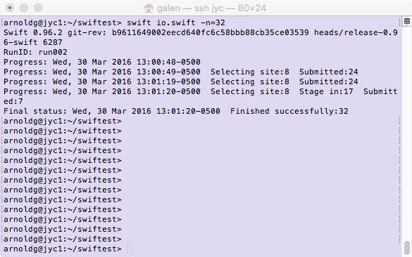
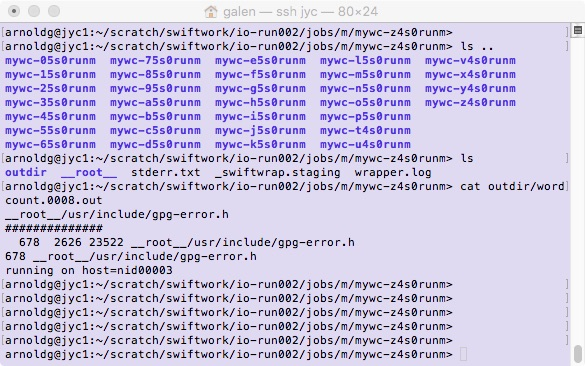
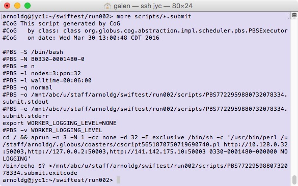

Swift
=====

A. Description
~~~~~~~~~~~~~~

Swift is parallel--it runs multiple programs concurrently as soon as
their inputs are available, reducing the need for complex parallel
programming.

Swift is easy--short, simple scripts can do large-scale work. The same
script runs on multicore computers, clusters, grids, clouds, and
supercomputers.

B. How to download Swift
~~~~~~~~~~~~~~~~~~~~~~~~

To use (or test) swift, you will need a copy of it
from:\ \ http://swift-lang.org/packages/swift-0.96.2.tar.gz

Once you've extracted it, add it to your PATH (.bashrc example):

-  export PATH=/u/staff/arnoldg/swift-0.96.2/bin:$PATH

C. Example setup
~~~~~~~~~~~~~~~~

Swift example configuration files are attached to this page.

-  `swift.conf </c/document_library/get_file?uuid=254bfa91-7833-4436-98dc-3959c91ba066&groupId=10157>`__\ is
   the configuration file read by swift and should reside in the
   directory with your \*.swift file(s)

   -  see the\ `swift user
      guide <http://swift-lang.org/guides/release-0.96/userguide/userguide.html>`__\ for
      more information about items in the swift.conf file

-  `io.swift </c/document_library/get_file?uuid=b5d18bcc-59a5-4131-9b03-b38ceb652b32&groupId=10157>`__\ is
   my sample workflow. It creates simple (identical) tasks which count
   the numger of header files in /usr/include and save the wordcount
   (wc) output from each task.

Swift runs from a login node (and starts some java threads). The
overhead seems to be low for java and it can retry if there's a problem
with the workflow, or it will provide detailed log and stderr output if
there is a problem. The sample job setup looked like this when run from
jyc where queue wait time is nearly zero, and this workflow ran on 2
nodes:

::

   arnoldg@jyc1:~/scratch/swiftwork/io-run002/jobs/m> grep host */outdir/* | cut -d= -f2 | sort | uniq -c 12 nid00002 20 nid00003

The workDirectory defined in your swift.conf will contained the results
from running your swift workflow. In the example here, notice there's a
separate directory for each of the -n=32 tasks specified on the swift
command line above. In each of those directories, further log, stderr
and output may be found. The filesystem organization can be configured
with changes to swift.conf.

Also corresponding to each run of swift (and task) is a directory
hierarchy in the directory where you submitted the workflow. Very
detailed logs will be stored there along with the job script that was
built and submitted to the batch system.

D. Read more about Swift.
~~~~~~~~~~~~~~~~~~~~~~~~~

-  http://swift-lang.org
-  https://www.alcf.anl.gov/swift
