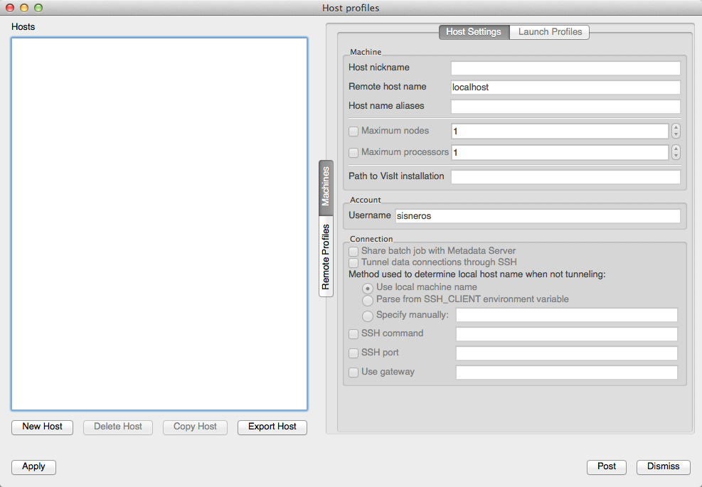

VisIt
-----

VisIt is a free interactive parallel visualization and graphical
analysis tool for viewing scientific data on Unix and PC platforms.
Users can quickly generate visualizations from their data, animate them
through time, manipulate them, and save the resulting images for
presentations. VisIt contains a rich set of visualization features so
that you can view your data in a variety of ways. It can be used to
visualize scalar and vector fields defined on two- and three-dimensional
(2D and 3D) structured and unstructured meshes. VisIt was designed to
handle very large data set sizes in the terascale range and yet can also
handle small data sets in the kilobyte range. While VisIt is capable of
operating in several modes we strongly recommend (and only support)
client/server mode where the client is local and batch mode through
VisIt's command line interface. We will describe these methods below.

Client/Server Mode in VisIt
~~~~~~~~~~~~~~~~~~~~~~~~~~~

VisIt's client/server mode will require the installation of VisIt client
software on a local workstation or laptop. There are precompiled
binaries for Windows (exe installer), MacOS X(dmg), and Unix which can
be downloaded
`here <https://wci.llnl.gov/codes/visit/executables.html>`__. The
`download page <https://wci.llnl.gov/codes/visit/executables.html>`__
also contains detailed installation instructions. NCSA will support
several versions of VisIt; for a list of current available versions,
enter the following at a Blue Water's prompt:

``> module avail visit``

You *must* use a client on your laptop that matches at least the minor
version number to be able to connect to Blue Waters and start a remote
session, VisIt will hang while staring the metadata server otherwise.
For example versions ``2.12.0`` and ``2.12.1`` are compatible but not
``2.12.0`` and ``2.13.0``.

To connect a client to Blue Waters and start a remote session you need a
Blue Waters "host profile." A host profile contains the information
VisIt uses to launch parallel server software at a remote location.
Below we will show how to load a Blue Waters host profile or create one
by hand.

-  Open the host profile window: under the Options pulldown menu, select
   "Host Profiles."

-  Newer releases of VisIt allow you to download host configurations for
   many HPC centers. To utilize this feature:

   #. Clck the vertical "Remote Profiles" tab.

   #. 

      .. container::

         Press "Update." This will download the sites known to VisIt.

   #. 

      .. container::

         .. container::

            Find the NCSA entry and expand to show the available host
            profiles.

   #. 

      .. container::

         Drag the Blue Waters XML file over to the hosts window.

.. image:: /image/image_gallery?uuid=eb6d41d4-1240-4999-aabf-48eb58b1bda0&groupId=10157&t=1400697834334

Note: this profile contains general settings and should work as-is, but
could likely be better tailored to specific requirements/preferences. We
therefore recommend at least awareness of the settings shown below.

To make sure this profile is available the next time you load VisIt, use
"Save Settings" from the Options pulldown. In fact, it is necessary to
save settings to make any customization in VisIt persist beyond a
current session. We will now show the relevant information to set up a
host profile by hand.

-  Host profiles contain "Host Settings" and a series of separate
   "Launch Profiles" for saving multiple luanch scenarios. We will show
   how these fields are set in the general Blue Waters host profile and
   these may be copied into the host profile window of older versions of
   VisIt. **For Duo authentication use h2ologin-duo.ncsa.illinois.edu
   and h2ologin#-duo.ncsa.illinois.edu below.** Blue Waters host
   settings:

.. image:: /liferay-content/image-gallery/content/hostProfile3.png

| 
| **Note:** For VisIt 3.X please use ``/sw/xe/visit/3.x`` for "Path to
  VisIt Installation".
| **Note:** verify that the host profile contains the correct account
  "Username." This should be your Blue Waters username.

-  Next is the two launch profiles we have created. "Parallel" with
   launch a VisIt engine on Blue Waters' compute nodes. "Serial..." will
   launch on a login node and should only be used when investigating
   very small test data.

.. image:: /image/image_gallery?uuid=0422b4c3-836b-4ad5-a621-06ac976f2611&groupId=10157&t=1400697834335

Note: Adding another profile is done with the "New Profile" button.
Beyond renaming, this was the only step necessary to create the serial
launch profile.

-  Parallel launch profile:

| |image1|

| Queue: sets ``qsub -q``
| Processors: sets ``aprun -n``
| Nodes: sets ``qsub -lnodes=``
| Account: sets ``qsub -A``
| Time: sets ``qsub -lwalltime=``

Note: it may be useful to use the debug queue in 30 minute blocks for
exploratory/refinement tasks.

Note: A user associated with multiple allocations should be especially
careful to set Account correctly.

**Reminder: to ensure a profile is available the next time you load
VisIt, use "Save Settings" from the Options pulldown. It is necessary to
save settings to make any customization in VisIt persist beyond the
current session.**

For Beginners: A Client/Server Quick Start to Seeing Data
~~~~~~~~~~~~~~~~~~~~~~~~~~~~~~~~~~~~~~~~~~~~~~~~~~~~~~~~~

VisIt works by allowing a user to specify an execution pipeline in which
a series of operations are applied to a dataset and the results are
plotted into the viewer (the large window). The following is a series of
steps to accomplish this basic VisIt task.

#. Open a dataset: under the File pulldown menu, selecting "Open File"
   starts a typical file navigation window. The "Active Source" in the
   small GUI window's Sources box should display the name of the open
   dataset.
#. Selecting "BlueWaters" from the top drop down (Hosts) will open a
   password dialogue: enter Blue Waters PASSCODE. VisIt will launch a
   metadata server on Blue Waters and the navigation window opened in
   the last step may now be used to find the desired data.
#. So far, there has been little change in the client interface, and at
   this point VisIt's engine is still not running. In the GUI, click
   "Add."
#. The resulting menu is a display of VisIt's plot types. All that are
   activated in the list are appropriate for the loaded data. Mousing
   over an active plot in this menu will show the dataset's suitable
   variables for that plot type. Selecting a plot and its variable(s)
   will add an entry to the Plots box of the GUI.
#. Similarly, clicking "Operators" shows a list of available operations
   that may be applied to the data before plotting. Making a selection
   will add the operator to the entry in the Plots box. Attributes for
   the plot as well as all applied operators are configurable. This can
   be done by double clicking the plot/operator name in the Plots box,
   or through the Plot Attributes and Operator Attributes pulldown
   menus.
#. Executing the pipeline is done by clicking "Draw" and the results
   will be displayed in the viewer.

Visit's Command Line Interface and Batch Mode
~~~~~~~~~~~~~~~~~~~~~~~~~~~~~~~~~~~~~~~~~~~~~

VisIt's command line interface (or CLI) is a Python-based, alternate
interface to driving VisIt. The CLI can be started from the GUI by
selecting "Command" from the Controls pulldown menu. Alternately, from
the prompt on Blue Waters:

``>module load visit     >visit -cli``

If VisIt starts directly from the command line, a script may be sourced
with the "-s" flag and a script name, as in
``visit -cli -s scriptname.py``. If the Python interpreter is already
running, ``>>>Source("scriptname.py")`` is the equivalent. The following
is a sample `VisIt Python
script </c/document_library/get_file?uuid=ee0a7d1e-2a05-42d1-ba48-d0cc29e5d5a5&groupId=10157>`__
that opens a database and performs a psuedocolor plot on data that lives
in VisIt's source directory.

+-----------------------------------+---------------------------------+
| ``# testbatch.py --               |                                 |
|  tests parallel engine in batch`` |                                 |
+-----------------------------------+---------------------------------+
| ``from sys import exit``          | ``#``                           |
+-----------------------------------+---------------------------------+
| ``s = SaveWindowAttributes()``    | ``# specify window attributes`` |
+-----------------------------------+---------------------------------+
| ``s.format = s.JPEG``             | ``# for saving to a file``      |
+-----------------------------------+---------------------------------+
| ``s.width, s.height = 512,512``   | ``#``                           |
+-----------------------------------+---------------------------------+
| ``SetSaveWindowAttributes(s)``    | ``#``                           |
+-----------------------------------+---------------------------------+
| ``db="/sw/                        | ``# open database``             |
| xe/visit/2.5.2/data/noise.silo"`` |                                 |
+-----------------------------------+---------------------------------+
| ``OpenDatabase(db)``              | ``#``                           |
+-----------------------------------+---------------------------------+
| ``AddPl                           | ``# add a psuedocolor plot``    |
| ot("Pseudocolor","hardyglobal")`` |                                 |
+-----------------------------------+---------------------------------+
| ``DrawPlots()``                   | ``# draw and save``             |
+-----------------------------------+---------------------------------+
| ``SaveWindow()``                  | ``#``                           |
+-----------------------------------+---------------------------------+
| ``ClearCacheForAllEngines()``     | ``# clean up``                  |
+-----------------------------------+---------------------------------+
| ``DeleteAllPlots()``              | ``#``                           |
+-----------------------------------+---------------------------------+
| ``CloseDatabase(db)``             | ``#``                           |
+-----------------------------------+---------------------------------+
| ``ClearCacheForAllEngines()``     | ``#``                           |
+-----------------------------------+---------------------------------+
| ``CloseComputeEngine()``          | ``#``                           |
+-----------------------------------+---------------------------------+
| ``sys.exit()``                    | ``#``                           |
+-----------------------------------+---------------------------------+

Another important command line option to transition to full batch mode
is "-nowin", as in ``visit -cli -nowin -s scriptname.py``. -nowin
prevents the graphics window from appearing. One note: the
``sys.exit()`` call in the sample script is necessary; with this, the
Python interpreter will not wait indefinitely for input after executing
a script.

Finally, the script should be submitted to the Blue Waters job queue,
and executed across compute nodes. The following is the `batch
script </c/document_library/get_file?uuid=a19cadc6-20df-48e2-879c-3ba39b3628ca&groupId=10157>`__
that has VisIt execute the above Python script (run with
``qsub testbatch.pbs``):

===========================================================
``#!/bin/bash``                                             
``#PBS -j oe``                                              
``#PBS -V``                                                 
``#PBS -N visit_test``                                      
``#PBS -l nodes=1:ppn=16``                                  
``#PBS -l walltime=00:10:00``                               
``cd $PBS_O_WORKDIR``                                       
``. ${MODULESHOME}/init/bash``                              
``module load visit``                                       
``visit -cli -nowin -np 16 -nn 1 -l aprun -s testbatch.py`` 
===========================================================

As per usual with a batch script, the #PBS comments define qsub's
arguments and in this case creates a job named visit_test to be run on
16 processors (ppn) on a single node. VisIt then manages the deployment
of its parallel engine; "-l aprun" instructs VisIt to launch the engine
with the aprun command. The arguments for aprun are determined through
the specification of the number of processors (np) and the number of
nodes (nn). Note: this script will only work for versions of VisIt 2.7.2
and newer. Earlier versions, with regard to aprun, treated "-nn" as
processors per node rather than number of nodes. That is, in the above
case the VisIt command would be changed to include "-np 16 -nn 16".

`Result </image/image_gallery?uuid=dba519ae-f122-4453-a5f4-ac42b8343a0d&groupId=10157&t=1357747295098>`__
of running the above scripts.

Additional Information / References
~~~~~~~~~~~~~~~~~~~~~~~~~~~~~~~~~~~

-  `VisIt's homepage <https://wci.llnl.gov/codes/visit/>`__
-  `VisIt manuals <https://wci.llnl.gov/codes/visit/manuals.html>`__
-  `VisIt user community web
   site <http://visitusers.org/index.php?title=Main_Page>`__

.. |image1| image:: /image/image_gallery?uuid=fdafe8c5-7547-4480-85e2-90cc3e4f6710&groupId=10157&t=1400697834346
