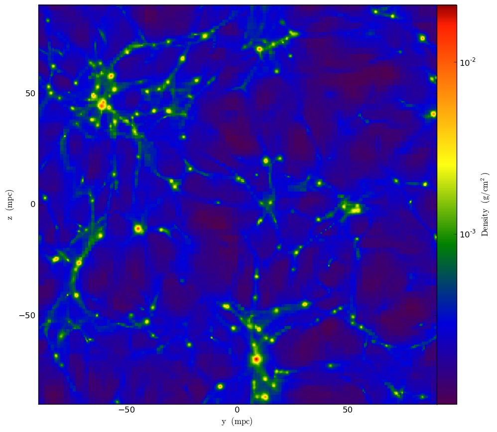
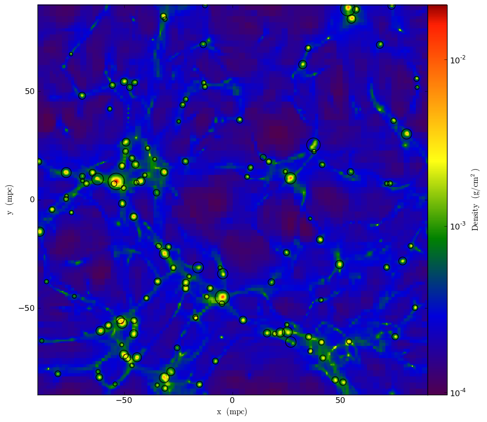

yt
==

yt is a Python-based astrophysics analysis tool that utilizes NumPy,
Matplotlib, and MPI for Python (only for parallel computations). The
following document is a directed mining of the comprehensive info
contained at the yt project's `documentation
page <http://yt-project.org/doc/>`__. From that site: "yt was designed
to be a completely Free ... user-extensible framework for analyzing and
visualizing astrophysical data, currently working with several different
codes, including the "flagship" codes Enzo, Orion, Nyx and FLASH. It
relies on no proprietary software although it can be and has been
extended to interface with proprietary software and libraries and has
been designed from the ground up to enable users to be as immersed in
the data as they desire."

Using yt
~~~~~~~~

yt separates analysis from visualization, and considers the former to be
likely comprised of a series of creating new, accessible fields (from
the possibly limited simulation output). Consider VisIt's or ParaView's
typical execution pattern: a series of operations manipulate data for
the purpose of creating a specific plot. The plot is further emphasized
in that an analysis starts only after a plot is added and culminates
when the plot is drawn. From yt's documentation: "While the heart of yt
is the large set of basic code, physical, reduced, and plot objects
already developed, in a metaphorical sense, its soul' is the fact that
any of the objects can be used as starting points for creating fields
and quantities of your own devices."

Example 1: Finding and Plotting Halos
^^^^^^^^^^^^^^^^^^^^^^^^^^^^^^^^^^^^^

The following is a simple
script that opens a dataset, performs the halo finding operation on the data,
creates a plot of the data, and finally annotates the plot where halos
were found (with black circles):

::

  from yt.mods import *
  pf = load("/sw/xe/yt/2.4/sles11.1_gnu4.3.4/yt-2.4/yt-x86_64/src/yt-hg/tests/DD0043/data0043")
  halos = HaloFinder(pf)
  p = ProjectionPlot(pf, "z", "Density")
  p.annotate_hop_circles(halos)
  p.save()

The
result:

a 2D projection plot that is saved to disk. In this image, areas
corresponding to the location of found halos should be circled.

Example 2: Parallel Computation with yt
^^^^^^^^^^^^^^^^^^^^^^^^^^^^^^^^^^^^^^^

A good deal of yt's functionality is designed to work in parallel (see
yt's `documentation page <http://yt-project.org/doc/>`__ for a complete
list). Furthermore, yt abstracts parallelism in that a user need only
pass the ``--parallel`` flag when running a python script. For any
supported operations, if mpi4py is available it will be used to perform
the operation in parallel. ``module load yt`` loads yt's Python build
that we have linked to mpi4py. The following test
`script </c/document_library/get_file?uuid=f04cdc49-912c-45f8-8276-65f501182ac8&groupId=10157>`__
calculates a max on some test data and then performs a projection plot,
both of which are supported parallel operations:

::

  from yt.mods import *`
  from yt.config import ytcfg;
  ytcfg["yt","serialize"] = "False"
  pf = load("/sw/xe/yt/2.4/sles11.1_gnu4.3.4/yt-2.4/yt-x86_64/src/yt-hg/tests/DD0043/data0043")
  print "----------------------" + str(ytcfg.getint("yt", "__topcomm_parallel_rank"))
  v, c = pf.h.find_max("Density")
  print v, c
  p = ProjectionPlot(pf, "x", "Density")
  p.save()
  
Here
is a batch script that may be used to run the above script:

:: 

  #!/bin/bash
  #PBS -j oe
  #PBS -V
  #PBS -N yttest
  #PBS -l nodes=2:ppn=16
  #PBS -l walltime=00:10:00

  . ${MODULESHOME}/init/bash
  module load yt
  aprun -n 16 -N 8 python parallel_yt.py --parallel

During
execution a each processor will print a hello world style message, and a
resulting plot 

will be saved to disk, this time along the x-axis so the results of both
example scripts won't clobber each other.

Additional Information / References
~~~~~~~~~~~~~~~~~~~~~~~~~~~~~~~~~~~

-  `yt's Homepage <http://yt-project.org/>`__
-  `Documentation <http://yt-project.org/doc/>`__
